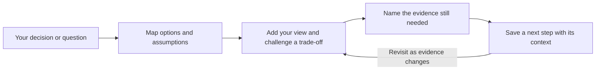
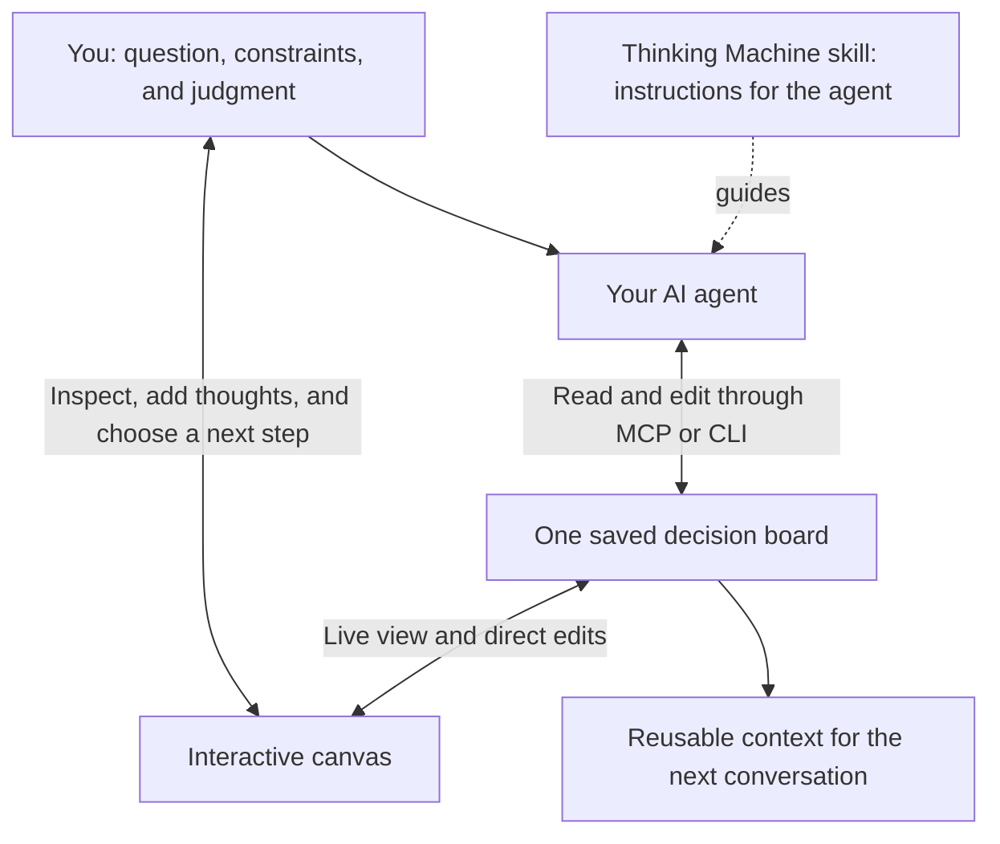

# Thinking Machine

**Turn an open-ended decision into a visible plan: options, assumptions, unanswered questions, and a next step.**

Thinking Machine is a local decision board for a technical user working with AI agents. When reasoning is scattered across chat messages, it is hard to see what supports a recommendation or what still needs checking. `tmind` keeps that reasoning in an editable map you can return to as evidence changes.

[Try the demo](#try-it-yourself-no-ai-account-needed) · [Usage guide](docs/USAGE.md) · [Watch the 80-second demo](docs/demo/walkthrough.mp4) · [Engineering evidence](#engineering-evidence) · [Architecture](#architecture-and-tradeoffs)

## See the decision, not just the answer

**Watch the captioned demo (80 seconds)** — add a human concern, explore a branch, and see a decision update live.

https://github.com/user-attachments/assets/52c2d303-1ca2-4408-be21-962b759cd5f8

[Download MP4](docs/demo/walkthrough.mp4) · [Text walkthrough](docs/demo/README.md) · [Static screenshot](docs/demo/support-pilot.png)

*Fictional example: should a small support team pilot an AI assistant? All content is illustrative; no customer data or measured business results.*



| Before | What you leave with |
|---|---|
| “Should we automate support?” | Compare a human-reviewed pilot with automatic replies. |
| A plausible recommendation with hidden assumptions | Visible `drafted` and `informed-opinion` labels, plus a question about reply quality. |
| A decision that loses its context | A saved outcome, the alternative's rationale, and the test needed before expanding the rollout. |

**The value is a reviewable decision record.** The example chooses a human-reviewed pilot while keeping the quality question open. It does not claim the assistant has passed that test, reduced support costs, or improved decision quality in a measured study.

## How it fits your workflow

**The skill guides the agent; the app keeps the thinking visible.** Install the skill in a supported coding agent, connect the CLI or MCP tools, and open the canvas. You can also use the canvas on its own.



| In your work | Ask the agent | Contribute on the canvas | What you keep |
|---|---|---|---|
| Before building | “Compare three approaches, including doing nothing.” | Add constraints and explain which trade-off matters. | Options and the rationale for choosing one. |
| When a claim is uncertain | “What evidence would change this decision?” | Record an unanswered question and a proposed check. | A visible boundary between an idea and evidence. |
| When returning later | “Recall related thinking and explain where this context differs.” | Update your reasoning and next step. | Context you can reuse without reconstructing a chat. |

These are supported usage patterns, not measured productivity claims. The skill's instructions guide model behavior; the application does not guarantee that the agent follows them or that every consideration is discovered. [Setup and example prompts](docs/USAGE.md#connect-real-ai-assistance).

## Try it yourself (no AI account needed)

Requires **Node 22+ and pnpm 11+**. Install from source; there is no published npm package or hosted demo.

```bash
git clone https://github.com/Calvin1921/thinking-machine.git
cd thinking-machine
pnpm install --frozen-lockfile
pnpm -r build
pnpm demo
```

Open **http://localhost:8791**, then select **AI support pilot — fictional demo**. You should see two options and an amber question about draft quality. Click a card to select it; click its title or body again to edit. Changes persist locally.

In a second terminal, from the same clone:

```bash
node packages/cli/dist/index.js -f boards/demo/support-pilot.json resolve root \
  "Run a human-reviewed pilot; keep automatic sending off until quality is measured."
```

The canvas updates without reloading. The root now shows the decision; the unanswered quality question remains visible. That is the product loop: **reason → inspect → act → keep the context**.

- Stop with Ctrl-C. `pnpm demo` preserves edits between runs.
- `pnpm demo:reset` restores only the fictional demo board, replacing edits to that board.
- If port 8791 is busy, stop your earlier demo or use `TM_UI_PORT=8792 pnpm demo` (POSIX shell). The demo launcher does not terminate other port listeners.
- Build errors or missing modules: confirm Node/pnpm versions, rerun the install and build commands. [Full demo script and recording notes](docs/demo/README.md).

## Bring your own thinking

Use **Your thought → Add thought** to add an option, concern, or idea. Choose **Whole board** to think wider; select a concept to go deeper beneath it. **Thought details** lets you edit reasoning, trade-offs, open questions, and outcomes, with an explicit save and conflict feedback if an agent changed the same field.

**How to use** explains the map in the app. [The usage guide](docs/USAGE.md) walks through commands, expected results, manual editing, and agent prompts. [Capability review](docs/CAPABILITY-REVIEW.md) separates the distinctive features available now from the next useful investments.

## Install the agent skill

With Node.js/npm available, install the Thinking Machine instructions into your preferred supported agent:

```bash
npx skills@latest add Calvin1921/thinking-machine --skill thinking-machine
```

The installer supports agents including Codex and Claude Code. This installs the **skill instructions**; it does not install the CLI, build the canvas, or register an MCP server. Follow the quick start above for the application, then [connect your agent](docs/AGENTS-AND-CLI.md). See the [skills installer documentation](https://github.com/vercel-labs/skills#readme) for agent selection and global installation.

## Where AI and MCP add value

**AI proposes the breakdown; you inspect the reasoning.** The optional judge uses Claude Code to suggest smaller questions and options, or return a named gap when information is missing. It receives the selected node's context and can recall related notes from other boards using lexical search.

**MCP lets an agent work on the same board you see.** An MCP client can read and edit boards through tools backed by the same core library as the CLI and canvas. There is no second copy of the decision to reconcile. [Agent setup and commands](docs/AGENTS-AND-CLI.md).

**Labels distinguish claims from checked evidence.** Provenance records whether content is drafted, verified, refuted, an informed opinion, or stale. A verification label records a check supplied by a caller; the application does not independently establish truth.

The judge's response is validated as a subtree proposal or a gap before application, and boards are schema-validated before writing. **This checks structure, not factual correctness.** A model can still give a well-formed but unsupported answer. Human review remains necessary; a visible gap is useful only when the user or model notices it.

## Engineering evidence

| Signal | What is implemented / where to inspect |
|---|---|
| Shared domain logic | [Core operations](packages/core/src/ops.ts) are used by CLI, MCP, and web surfaces. |
| Validated model boundary | [Judge contract](packages/core/src/judge.ts), [schemas](packages/core/src/schema.ts), and [judge tests](packages/core/test/judge.test.ts). |
| Safer persistence | [Store](packages/core/src/board.ts) validates before temp-file rename and locks read-modify-write operations; [tests](packages/core/test/board.test.ts). |
| Failure handling | Invalid proposals fail before mutation; failed model subprocesses report errors. [CLI tests](packages/cli/test/cli.test.ts), [MCP tests](packages/mcp/test/mcp.test.ts), [sidecar tests](apps/web/server/sidecar.test.ts). |
| Local web boundary | Loopback binding, JSON body limit, CSP/security headers, and validated writes in the [sidecar](apps/web/server/sidecar.ts). |
| Accessibility foundations | Keyboard navigation, focus-path navigation, visible focus styling, and text status labels alongside color. See [canvas](apps/web/src/App.tsx) and [styles](apps/web/src/styles.css). Full screen-reader/WCAG conformance has not been established. |
| Repeatable checks | [CI](.github/workflows/ci.yml) installs locked dependencies, builds, typechecks web, and runs tests. Dependency auditing is advisory-only. |

```bash
pnpm -r build
pnpm --filter @tm/web typecheck
pnpm -r test
```

This demonstrates AI workflow integration, inspectable state, explicit uncertainty, and deliberate deployment boundaries. Automated tests check software behavior; they are not evidence of model reasoning quality. [Evaluation plan](docs/EVALUATION.md) describes behavioral targets, not published benchmark results.

## Architecture and tradeoffs

```text
CLI / AI judge       MCP agent tools       Web canvas
       \                   |                  | REST + live events
        \                  |             Local Express sidecar
         +-----------------+------------------+
                           |
                    Shared core library
                 validation + graph operations
                           |
                  Atomic write + lockfile
                           |
                    Local JSON boards
```

| Choice | Benefit | Cost / boundary |
|---|---|---|
| One JSON file per board | Portable, inspectable, easy to diff | Whole-file reads; lockfiles, no database transactions or multi-user collaboration. |
| Lexical recall | No embedding service or model needed | Misses synonyms and semantic matches. |
| Claude Code judge adapter | Reuses the target user's existing CLI setup | Requires installed/authenticated Claude Code; model calls have latency and usage costs. |
| Local sidecar + live file updates | Humans and agents see the same saved state | No authentication or hosted-service isolation; keep it local. |

Details and revisit triggers: [Architecture](docs/ARCHITECTURE.md). Package map: `packages/core` (domain/store), `packages/cli` (commands/judge adapter), `packages/mcp` (agent tools), `apps/web` (canvas/sidecar).

## Known limitations

- Single-user local tool; no shared workspaces, authentication, or internet-facing deployment support.
- AI output is nondeterministic. There is no shipped behavioral evaluation harness proving gap detection or truthfulness.
- The current judge adapter has no explicit timeout/retry budget. A dry run followed by `--yes` makes a **new model call**, not approval of the exact previous proposal.
- Provenance and outcomes are caller-supplied. Recording a “passed” status does not enforce a real-world test threshold.
- Automated interviews, typed probes, and board-to-Mermaid export are planned, not shipped. The diagram above is README documentation. See [capability status](docs/STATUS.md).

AI tools were used during development as well as in the optional product workflow. See [Contributing](CONTRIBUTING.md), [design document index](docs/README.md), and [MIT license](LICENSE).
