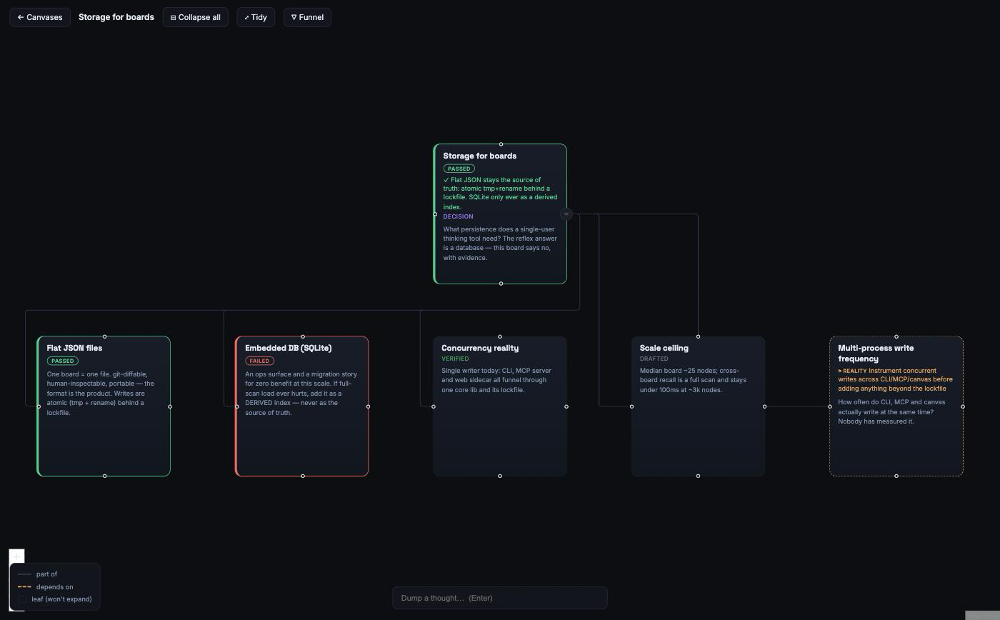

# Thinking Machine

**A decision-mapping workbench.** Before — and while — you act, `tm` lays out the tree of
considerations and decisions that most affect the outcome, grounded in the information
actually in hand and honest about what's missing.

Here is a real decision this repo made — *does a single-user thinking tool need a
database?* — mapped from the terminal:



Read it straight off the board:

- The **decision is closed**: the root carries the chosen outcome (✓) and the losing
  option stays on the map, marked FAILED, with its own "pick this if…" rationale for
  the day the conditions change.
- Every piece of **evidence carries its epistemic status**: VERIFIED (checked) vs
  DRAFTED (plausible, unchecked) — what you *know* is visibly separate from what you
  *assumed*.
- The one thing nobody has measured is not silence — it's the amber **gap node**,
  stating the exact question that would unblock it.

Notes and whiteboards hold whatever you happened to write down. This map also holds
what you *don't* know and what state every consideration is in. Same family of thinking
as consideration-mapping approaches like the "wayfinder" pattern (destination /
frontier / fog-of-war) — but tool-shaped instead of issue-tracker-shaped: a persistent
visual graph (CLI + MCP server + web canvas) that you and your agents keep. It is
built for one technical user (and their agents) thinking out loud, not for team
collaboration.

The board above took about a dozen commands:

```bash
tm new "Storage for boards" --root-type decision   # → boards/storage-for-boards.json
B=boards/storage-for-boards.json                   # node ids are slugs of the labels
tm -f $B add "Flat JSON files" --parent root --desc "One board = one file. git-diffable, portable…"
tm -f $B add "Concurrency reality" --parent root --desc "Single writer today — every surface funnels through one core lib."
tm -f $B add "Multi-process write frequency" --parent root --desc "Nobody has measured it."
tm -f $B status flat-json-files passed
tm -f $B rationale flat-json-files "pick this while single-user, single-writer"
tm -f $B provenance concurrency-reality verified
tm -f $B gap multi-process-write-frequency --kind reality \
   --question "Instrument concurrent writes before adding anything beyond the lockfile"
tm -f $B resolve root "Flat JSON stays the source of truth…"
tm ui --dir boards       # → the canvas above, live-updating as you keep editing
```

(`tm` = `node packages/cli/dist/index.js` from a clone — alias it once. This board was
placed by hand; `tm grow-auto <id> --yes` asks the embedded LLM-judge to propose the
subtree instead — or to plant a gap.)

## The three properties

1. **Gap-awareness — unknowns are first-class nodes, not silence.** When the judge (or
   you) can't support a path with the information in hand, the map gets a gap marker
   with the one unblocking question (`tm gap` / `tm resolve`). Unknown-unknowns become
   named gaps that can't be silently skipped.
2. **Decidability marking — every consideration shows its state.** Decided (outcome
   recorded with a rationale), laid out and ready for a call (options with pass/fail
   verdicts side by side), or blocked-on-unknown (a gap naming what evidence would
   unblock it).
3. **Typed provenance — the part notes apps don't have.** Every claim carries
   `drafted | verified | refuted | informed-opinion | stale`. `tm verify` records a
   check, `tm refresh-stale` downgrades verifications past their TTL, and recalled
   prior thinking carries its provenance with it (per line in the Claude Code recall
   hook, typed in the MCP output) — a borrowed conclusion is never silently trusted.

## Enforced, not encouraged

The honesty rules are type-system facts, not conventions. The LLM-judge's output
contract is a discriminated union — **either** child nodes **or** a gap — so
"confident children over missing information" is unrepresentable. Every judge proposal
is strict-parsed (zod) before it can touch a board, and the whole board is
schema-validated again before every write. Malformed output fails loud; it never
commits.

## Architecture

The intelligence lives in the CLI: an LLM-judge (Claude Code driven by a skill)
decomposes nodes; the React Flow canvas is a live view of the same file.

```
board.json  ── single source of truth (nodes, edges)
   ▲ atomic read-modify-write (+ lockfile), schema-validated before every write
 core lib ── ALL board operations; the Judge is a port (claude -p is one adapter)
   ▲          ▲            ▲
  CLI (tm)   MCP server   Web sidecar (Express)
                          ├─ REST read/write → core
                          └─ chokidar file-watch → SSE → React Flow canvas

 Skill `thinking-machine` ── teaches Claude Code the command vocabulary + the
                             decompose → confirm → commit method.
```

| Path | What |
|---|---|
| `packages/core` | zod schema + migrations, atomic-write/lockfile store, graph ops, judge contract, cross-board recall |
| `packages/cli` | `tm` — commander CLI over core, incl. the embedded judge (`grow-auto`) and `tm ui` |
| `packages/mcp` | MCP server exposing core ops as tools |
| `apps/web` | Express sidecar (REST + SSE) + React Flow canvas, 6 layout algorithms |
| `skill/thinking-machine` | the decomposition method + command reference |

## Tradeoffs

- **Flat JSON files over a database.** Boards are single-user and small; files are
  git-diffable, human-inspectable, and portable — the format is the product. The
  cost is whole-file reads and a lockfile instead of transactions. The revisit
  trigger (and why SQLite would only ever be a derived index) is in
  [docs/ARCHITECTURE.md](docs/ARCHITECTURE.md).
- **Lexical recall over embeddings.** Cross-board search is field-weighted token
  matching with a common-token cutoff: fast at the current corpus size with zero
  model dependency. The cost is no synonym matching. Embeddings stay a future
  derived index behind a port until recall precision measurably hurts.
- **`claude -p` as the only judge adapter.** No API-key setup for the target user
  (already inside Claude Code), at the cost of a CLI dependency. The `Judge` port
  keeps another provider one adapter away.

## Develop

```bash
pnpm install
pnpm -r build          # builds core → cli → mcp → web in dependency order
pnpm -r test           # 157 tests: 83 core · 19 cli · 18 mcp · 37 web

# create a board and open the canvas
mkdir boards
node packages/cli/dist/index.js --dir boards new "My Idea" --root-type objective
node packages/cli/dist/index.js ui --dir boards        # sidecar + canvas on :8787
```

`tm ui` auto-frees a stale port before starting. Edit the board from a second
terminal (`tm add`, `tm grow`, `tm gap`, …) and the canvas live-updates over SSE.

## Design docs

| Doc | What it answers |
|---|---|
| [docs/NORTH_STAR.md](docs/NORTH_STAR.md) | What the tool is for, the honesty rules, the test of success |
| [docs/STATUS.md](docs/STATUS.md) | North star vs. shipped code — capability scorecard + dependency-ordered build plan |
| [docs/ARCHITECTURE.md](docs/ARCHITECTURE.md) | Structure, and the deliberate infrastructure decisions (DB? RAG? daemon? — each "no" with its revisit trigger) |
| [docs/EVALUATION.md](docs/EVALUATION.md) | How each capability is proven — deterministic layer in CI, behavioral layer with pass-rate bars |

Full index, incl. the visual design ruler, canvas representation principles, and the
original system + feature specs: [docs/README.md](docs/README.md).

## Status

v1 shipped: deep canvas, full CLI + MCP + skill, live-reload loop, and the gap-aware
judge (commit-or-gap contract, PR #12). Open, in dependency order: automated
interview loop, typed probes, Mermaid/ASCII serializer, causal why-chains — see
[docs/STATUS.md](docs/STATUS.md).
