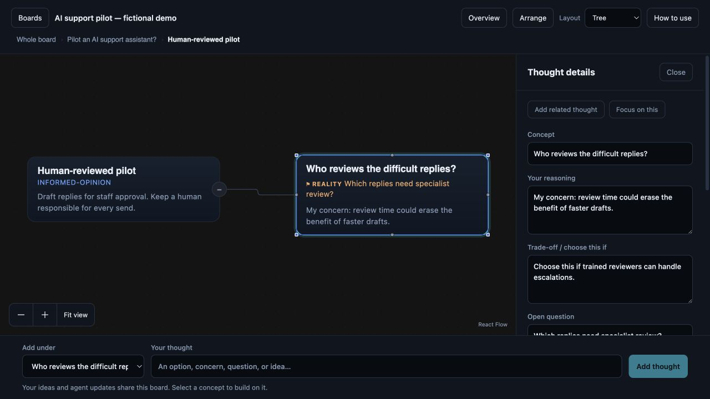

# Use Thinking Machine

Thinking Machine is a shared working surface for **your ideas and an agent’s proposals**. Use it to map a decision, challenge an assumption, go deeper into one concern, and keep the next step visible. It does not independently decide what is true.

## Start with something you can see

Requires Node 22+ and pnpm 11+. From a fresh clone:

```bash
git clone https://github.com/Calvin1921/thinking-machine.git
cd thinking-machine
pnpm install --frozen-lockfile
pnpm -r build
pnpm demo
```

**What each command does:** clone downloads the source; install gets the locked dependencies; build prepares the application; demo opens a local server with a fictional example. Visit **http://localhost:8791** and open **AI support pilot — fictional demo**. Nothing is sent to a model by these commands.

You should see a decision, two options, and an amber question about reply quality. The question names something that has not been measured. `drafted` means unchecked; `informed-opinion` means a judgment rather than a verified fact.

## Make it your thinking, too

| You want to… | Do this | What happens |
|---|---|---|
| Think wider | Choose **Whole board** under **Add under**; enter “What if we improve the help centre instead?” and press **Add thought**. | A new option appears on the board and is saved. |
| Think deeper | Select **Human-reviewed pilot**, then add “Who reviews difficult replies?” | The new thought is connected beneath that option, not beside the whole decision. |
| Explain your view | Select the new thought. Enter **Your reasoning** in Thought details, then **Save changes**. | Your reasoning appears on the card and persists in the same JSON board agents read. |
| Preserve a trade-off | Fill **Trade-off / choose this if**. | The rationale stays attached to that option for later review. |
| Name missing evidence | Enter **Open question** and choose what is missing. | The card displays an amber question. This records uncertainty; it does not run the test. |
| Choose a next step | Fill **Outcome / next step**. | The outcome appears on the card. Open questions and status remain independent; clear a question only when answered. |
| Change your mind | Edit the saved reasoning or outcome and save again. | The board reflects the current decision. There is no built-in revision history or undo. |

A concrete addition for the demo:

> **Concept:** Who reviews difficult replies?  
> **Reasoning:** Faster drafts may not help if reviewing them takes too long.  
> **Choose this if:** Trained reviewers can handle escalations.  
> **Open question:** Which replies need specialist review?  
> **Next step:** Try a review exercise with synthetic tickets.

All of these are fictional suggestions, not research findings.



## Navigate a larger map

- **Arrange** reorganizes the board using the chosen layout. Manual additions initially appear clear of existing cards; Arrange makes a larger tree easier to scan.
- **Fit view** brings the currently visible map into view. Use the adjacent zoom controls or pan the canvas.
- **Overview** collapses deeper branches; **Expand all** reveals them again.
- Select a concept and use **Focus on this** to see its subtree. Double-clicking the card background also focuses it. Breadcrumbs and Escape take you back out. Sectioned boards retain their section layout.
- **Layout** offers tree, funnel, grid, timeline, radial, and concentric views. Choose the representation that fits the content. Grid hides relationship lines; the underlying graph is still saved.
- Click a selected card’s title or text for an inline edit. For several fields, use the details panel’s explicit save. On narrow screens, **Close** returns from details to the map.

The corner controls share the canvas palette. **React Flow** is the underlying canvas library credit; it remains visible without a bright badge. **How to use** explains line types, evidence labels, and useful thinking prompts.

## See the human–agent loop without an AI account

Leave the browser open. In a second terminal at the clone root:

```bash
node packages/cli/dist/index.js -f boards/demo/support-pilot.json add \
  "What if we improve self-service instead?" --parent root --kind branch \
  --desc "An alternative to compare with the assistant pilot."
```

**Expected result:** a new option appears without a page reload. This command exercises the same core graph operations that the agent tools use. It is a deterministic demonstration, not a live AI call.

Record a next step from the terminal:

```bash
node packages/cli/dist/index.js -f boards/demo/support-pilot.json resolve root \
  "Try a human-reviewed pilot while measuring quality."
```

**Expected result:** the root displays the outcome and `passed` status. CLI `resolve` closes the selected node’s own gap; it leaves the separate quality-gap node open. Here `passed` means the decision is recorded, not that reply quality has passed a test. The UI’s outcome field deliberately lets you record a next step without changing status or clearing a question.

Read the full saved board:

```bash
node packages/cli/dist/index.js -f boards/demo/support-pilot.json show --json
```

**Expected result:** JSON containing your concepts, descriptions, relationships, questions, and outcome. Boards live under `boards/demo`; `pnpm demo:reset` replaces only the demo board with its starting fixture. Back up your edits before resetting if you want to keep them.

## Connect real AI assistance

Install the instructions into a supported agent:

```bash
npx skills@latest add Calvin1921/thinking-machine --skill thinking-machine
```

This installs the **skill**, not the application or MCP server. Use a current Node release supported by the installer (the checked installer requires at least 22.20.0). Follow [agent setup](AGENTS-AND-CLI.md) for MCP and the optional Claude Code judge.

Once an MCP client is connected, try these requests:

- “Compare three approaches to this decision, including the option of doing nothing. State when each would be appropriate.”
- “Read my review-time concern. Expand that branch, keeping my reasoning and labelling untested claims.”
- “What evidence would change this decision? Record the most useful unanswered question.”
- “Recall related thinking from this demo store, explain where the context differs, and suggest what we can reuse.”

The agent proposes and edits; you inspect and contribute. Model responses vary. Schema validation checks structure, not truth or the completeness of the considerations.

## Save behavior and limits

The thought composer keeps its text on a failed request. The details panel keeps an unsaved draft when other changes arrive. On save, changed fields are compared with the version you began editing: unrelated updates can merge; a same-field conflict is rejected without a partial write. **Compare latest version** lets you discard your draft or keep your edits for the next save. Leaving unsaved details through the app prompts you first.

Conflict checking applies to **Thought details**. Existing inline edits, CLI/MCP writes, and layout actions are not a version-history system. Keep separate backups or Git history for valuable boards. The app is local and single-user; it has no authentication, collaborative accounts, automated fact-checking, or automatic real-world test execution.
