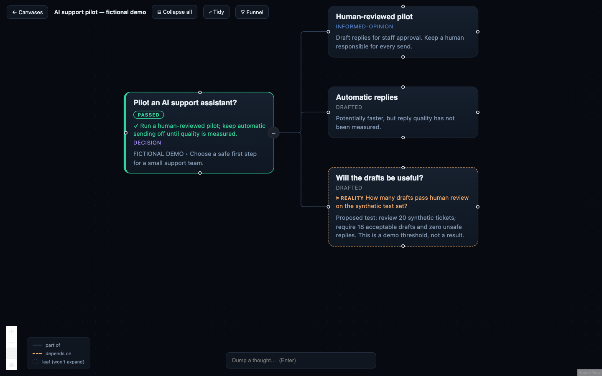

# Thinking Machine: 90-second demo

**Audience:** a hiring manager assessing AI product engineering. **Takeaway:** an AI-assisted decision can remain inspectable, editable, and explicit about missing evidence.

This walkthrough uses a handcrafted fictional board, not a recorded model response. No support tickets are included or evaluated. The suggested 20-ticket test and 18-draft threshold are illustrative. No external AI call is needed.

## Prepare

Follow the [quick start](../../README.md#try-it-yourself-no-ai-account-needed), then run `pnpm demo:reset` to restore the starting state. Open the fictional board at http://localhost:8791. Frame all four cards using **Fit View**. Keep a second terminal at the clone root, ready with the outcome command below.

Capture only the app window. Hide notifications and account/browser chrome; do not show terminal prompts, shell history, personal boards, or MCP account configuration. The demo launcher serves only `boards/demo`. Use the same isolated directory for any optional AI segment.

## Recording status

Recording is deferred at the owner’s request. Use OpenScreen and record one project at a time. Before recording, rehearse the [interactive contribution flow](../USAGE.md): add a human concern under an option, edit its reasoning, and save it. The short OpenScreen framing checks are not final demos.

## Script and shot list

| Time | Show / do | Say |
|---|---|---|
| 0–12s | Full board; point to the question | “When a decision is spread across an AI chat, it is easy to lose the assumptions behind the answer. Thinking Machine keeps the question, options, and missing evidence together.” |
| 12–27s | Select Human-reviewed pilot; add “Who reviews difficult replies?” | “This fictional team is comparing a reviewed pilot with automatic replies. I can contribute my own concern: who reviews the difficult replies? My thought becomes a connected part of the decision.” |
| 27–43s | Select the added thought; enter “Review time may erase the benefit.” in Your reasoning; save and close | “I can explain my reasoning and record trade-offs or questions. The existing amber question still marks missing quality evidence. These labels describe recorded judgments and checks, not automatic truth.” |
| 43–60s | Run the command off-camera; keep the canvas visible as it updates | “I’ll record a bounded decision: try a human-reviewed pilot. The board updates live. The quality gap remains open, so choosing a next step does not pretend the uncertainty is solved.” |
| 60–76s | Hold on the completed board | “An AI agent can edit this same board through MCP. The optional judge can suggest a breakdown or flag a gap. Validation protects the data structure; it cannot prove an AI answer is true.” |
| 76–90s | Show the saved outcome and gap together | “The result is a decision record you can revisit: what we chose, what we assumed, and what to test next. It is a local, single-user tool, and this demo runs without an AI account.” |

Outcome command, from the clone root:

```bash
node packages/cli/dist/index.js -f boards/demo/support-pilot.json resolve root \
  "Run a human-reviewed pilot; keep automatic sending off until quality is measured."
```

`PASSED` on the root means the decision was recorded using `resolve`; it does **not** mean the proposed reply-quality test passed. Point out the still-open gap if asked.

## Demo-safe assets

- [Interactive editor screenshot](interactive-thinking.png) — current UI with a human contribution.
- [Starting board screenshot](support-pilot.png) — actual running UI.
- [Recorded outcome screenshot](support-pilot-outcome.png) — same UI after the CLI command, received through live updates.
- [Source fixture](../../examples/support-pilot.json) — fictional, editable JSON validated by the core on preparation.
- [Demo launcher](../../scripts/demo.mjs) — preserves edits; `pnpm demo:reset` explicitly replaces only the demo fixture copy.



For a presentation without a running app, use the two screenshots as before/after slides and say they are captures. A narrated video is not included; the script above is ready to record. Do not describe this deterministic walkthrough as a live AI demonstration.

## Optional technical follow-up

Use [agent setup](../AGENTS-AND-CLI.md) to show an actual model proposal after the main demo. Allow for latency and variable output. The default judge call is a dry run; rerunning with `--yes` generates and commits a new proposal. Do not promise that it will reproduce a prepared answer.

For accessibility, the script also serves as a text walkthrough. The screenshots have descriptive alternatives, and `show --json` exposes the full board without navigating the canvas.
